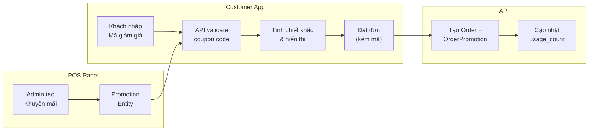

# 🎟️ Sprint 2: Chương trình Khuyến mãi & Mã giảm giá (Promotions & Coupons)

> **Mục tiêu**: Cho phép quán tạo chương trình khuyến mãi/mã giảm giá, khách hàng nhập mã tại giỏ hàng để được chiết khấu, và quản lý hiệu quả khuyến mãi trên POS.

---

## Thiết kế Tổng quan



---

## Proposed Changes

### 1. Database — Entities mới & sửa đổi

---

#### [NEW] `promotion.entity.ts`

Bảng `promotions` — Lưu trữ chương trình khuyến mãi / mã giảm giá.

| Cột | Kiểu | Mô tả |
|-----|------|-------|
| `id` | `PrimaryGeneratedColumn` | Khóa chính |
| `store_id` | `number` (FK → stores) | Quán sở hữu promotion |
| `name` | `varchar(200)` | Tên chương trình (VD: "Giảm 20% đơn đầu tiên") |
| `description` | `varchar(500)`, nullable | Mô tả chi tiết |
| `type` | `enum: 'PERCENT' \| 'FIXED' \| 'FREE_ITEM'` | Loại chiết khấu |
| `value` | `decimal(12,0)` | Giá trị: % hoặc số tiền cố định |
| `code` | `varchar(50)`, nullable, unique per store | Mã giảm giá (VD: "WELCOME20"). Nullable = khuyến mãi tự động / banner |
| `min_order_amount` | `decimal(12,0)`, default 0 | Đơn tối thiểu để áp dụng |
| `max_discount` | `decimal(12,0)`, nullable | Giới hạn giảm tối đa (cho loại PERCENT) |
| `usage_limit` | `int`, nullable | Số lần sử dụng tối đa (null = không giới hạn) |
| `usage_count` | `int`, default 0 | Số lần đã sử dụng |
| `per_customer_limit` | `int`, default 1 | Số lần mỗi khách được dùng |
| `start_date` | `timestamp` | Ngày bắt đầu |
| `end_date` | `timestamp` | Ngày kết thúc |
| `is_active` | `boolean`, default true | Trạng thái hoạt động |
| `free_product_id` | `number`, nullable (FK → products) | Sản phẩm miễn phí (khi type = FREE_ITEM) |
| `created_at` | `CreateDateColumn` | — |
| `updated_at` | `UpdateDateColumn` | — |

**Relations**: `ManyToOne → Store`, `ManyToOne → Product` (nullable, cho FREE_ITEM)

---

#### [NEW] `order-promotion.entity.ts`

Bảng `order_promotions` — Ghi nhận promotion đã áp dụng cho đơn hàng nào.

| Cột | Kiểu | Mô tả |
|-----|------|-------|
| `id` | `PrimaryGeneratedColumn` | Khóa chính |
| `order_id` | `number` (FK → orders) | Đơn hàng |
| `promotion_id` | `number` (FK → promotions) | Khuyến mãi đã dùng |
| `code_used` | `varchar(50)`, nullable | Mã đã nhập (snapshot) |
| `discount_amount` | `decimal(12,0)` | Số tiền được giảm |
| `created_at` | `CreateDateColumn` | — |

**Relations**: `ManyToOne → Order` (onDelete: CASCADE), `ManyToOne → Promotion` (onDelete: SET NULL)

---

#### [MODIFY] `order.entity.ts`

Thêm 2 cột mới:

| Cột mới | Kiểu | Mô tả |
|---------|------|-------|
| `discount_amount` | `decimal(12,0)`, default 0 | Tổng tiền giảm giá |
| `final_amount` | `decimal(12,0)`, default 0 | Số tiền thực trả = `total_amount - discount_amount` |

Thêm relation: `OneToOne → OrderPromotion`

> [!IMPORTANT]
> **Lựa chọn thiết kế**: Giữ nguyên `total_amount` là tổng giá gốc (trước giảm). Thêm `discount_amount` và `final_amount` để tách biệt rõ ràng. Payment sẽ dùng `final_amount` thay vì `total_amount`.

---

### 2. Backend — Module Promotions

---

#### [NEW] `modules/promotions/` — Module mới

Cấu trúc:
```
modules/promotions/
├── promotions.module.ts
├── promotions.controller.ts
├── promotions.service.ts
└── dto/
    ├── create-promotion.dto.ts
    └── validate-coupon.dto.ts
```

**API Endpoints**:

| Method | Route | Auth | Mô tả |
|--------|-------|------|-------|
| `POST` | `/promotions` | JwtAuth + Admin | Tạo khuyến mãi mới |
| `GET` | `/promotions/store/:storeId` | JwtAuth + Admin | Lấy danh sách KM của store |
| `GET` | `/promotions/:id` | JwtAuth + Admin | Chi tiết KM |
| `PATCH` | `/promotions/:id` | JwtAuth + Admin | Cập nhật KM |
| `DELETE` | `/promotions/:id` | JwtAuth + Admin | Xóa KM |
| `POST` | `/promotions/validate` | None (public) | Validate mã giảm giá — trả về thông tin chiết khấu |
| `GET` | `/promotions/store/:storeId/active` | None (public) | Lấy KM đang chạy (banner hiển thị trên Customer App) |

**Logic validate mã giảm giá** (`POST /promotions/validate`):

```
Input: { code, store_id, order_amount, customer_id? }
Checks:
  1. Mã tồn tại & thuộc store
  2. is_active = true
  3. now() BETWEEN start_date AND end_date
  4. usage_count < usage_limit (nếu có limit)
  5. order_amount >= min_order_amount
  6. Nếu customer_id → kiểm tra per_customer_limit (đếm OrderPromotion)
Output: { valid: true, promotion, discount_amount }
```

---

#### [MODIFY] `modules/orders/orders.service.ts`

Cập nhật flow `createOrder()`:

```diff
 // 6. Cập nhật total
 saved.total_amount = totalAmount;
+
+ // 7. Áp dụng khuyến mãi (nếu có)
+ if (dto.coupon_code) {
+   const discount = await this.promotionsService.applyPromotion(
+     dto.coupon_code, saved.store_id, totalAmount, dto.customer_id
+   );
+   saved.discount_amount = discount.discount_amount;
+   saved.final_amount = totalAmount - discount.discount_amount;
+   // Tạo OrderPromotion record
+ } else {
+   saved.discount_amount = 0;
+   saved.final_amount = totalAmount;
+ }
```

#### [MODIFY] `modules/orders/orders.service.ts` — `processPayment()`

```diff
- payment.amount = Number(order.total_amount);
+ payment.amount = Number(order.final_amount);
```

---

### 3. Shared Types — Cập nhật

---

#### [MODIFY] `packages/shared-types/src/dto/index.ts`

```typescript
// Thêm vào CreateOrderDto
export interface CreateOrderDto {
  session_token: string;
  items: CreateOrderItemDto[];
  customer_id?: number;
  coupon_code?: string;          // ← MỚI
}

// DTO mới
export interface ValidateCouponDto {
  code: string;
  store_id: number;
  order_amount: number;
  customer_id?: number;
}

export interface ValidateCouponResponseDto {
  valid: boolean;
  promotion_name?: string;
  discount_type?: 'PERCENT' | 'FIXED' | 'FREE_ITEM';
  discount_amount?: number;
  message?: string;
}
```

#### [MODIFY] `packages/shared-types/src/enums/index.ts`

```typescript
export enum PromotionType {
  PERCENT = 'PERCENT',
  FIXED = 'FIXED',
  FREE_ITEM = 'FREE_ITEM',
}
```

---

### 4. Frontend — Customer App

---

#### [MODIFY] Cart Page (`apps/customer/app/(order)/[storeSlug]/cart/page.tsx`)

Thêm phần nhập mã giảm giá **phía trên thanh tổng cộng ở dưới**:

- **Input nhập mã** với nút "Áp dụng" → gọi `POST /promotions/validate`
- Hiển thị kết quả: tên KM, số tiền giảm, thông báo lỗi
- **Cập nhật thanh tổng cộng**: hiển thị 3 dòng thay vì 1:

```
Tạm tính (X món)              150.000đ
Giảm giá (WELCOME20)          -30.000đ   ← màu xanh lá
─────────────────────────────────────────
Tổng thanh toán                120.000đ   ← in đậm
```

#### [NEW] Hook `useCoupon.ts`

```typescript
interface UseCouponReturn {
  couponCode: string;
  setCouponCode: (code: string) => void;
  appliedCoupon: ValidateCouponResponseDto | null;
  isValidating: boolean;
  error: string | null;
  validateCoupon: (orderAmount: number, storeId: number) => Promise<void>;
  clearCoupon: () => void;
}
```

#### [MODIFY] Menu Page (`apps/customer/app/(order)/[storeSlug]/menu/page.tsx`)

- Thêm **Banner khuyến mãi** (carousel nhỏ) ngay dưới thanh tìm kiếm, trước danh mục sản phẩm
- Chỉ hiển thị các promotion đang active có `code` (để khách biết mã)
- UI: card gradient nổi bật với tên KM, mã, thời hạn

#### [MODIFY] `useOrder.ts`

- Truyền `coupon_code` vào `createOrder` nếu khách đã áp dụng mã thành công

---

### 5. Frontend — POS Panel

---

#### [NEW] Trang Quản lý Khuyến mãi (`apps/pos/app/dashboard/promotions/page.tsx`)

Giao diện quản lý đầy đủ:

- **Bảng danh sách** hiển thị: Tên, Mã, Loại (badge), Giá trị, Đã dùng/Giới hạn, Thời hạn, Trạng thái (Active/Expired/Upcoming)
- **Nút tạo mới** → Bottom Sheet / Modal form với các trường:
  - Tên chương trình, Mô tả
  - Loại giảm giá (Dropdown: Giảm %, Giảm cố định, Tặng sản phẩm)
  - Giá trị, Giảm tối đa, Đơn tối thiểu
  - Mã giảm giá (auto-generate hoặc nhập tay)
  - Giới hạn sử dụng, Giới hạn/khách
  - Ngày bắt đầu – Ngày kết thúc
- **Actions**: Sửa, Bật/Tắt, Xóa
- **Thống kê nhanh** ở đầu trang: Tổng KM đang chạy, Tổng lượt sử dụng, Tổng tiền đã giảm

#### [MODIFY] `Sidebar.tsx`

```diff
+ { href: '/dashboard/promotions', label: 'Khuyến mãi', icon: Tag, adminOnly: true },
```

Vị trí: sau "Đánh giá", trước "Báo cáo"

---

## Tổng kết File Changes

| Loại | File | Thay đổi |
|------|------|----------|
| **[NEW]** | `api/src/database/entities/promotion.entity.ts` | Entity mới |
| **[NEW]** | `api/src/database/entities/order-promotion.entity.ts` | Entity mới |
| **[MODIFY]** | `api/src/database/entities/order.entity.ts` | +2 cột, +1 relation |
| **[MODIFY]** | `api/src/database/entities/index.ts` | Export 2 entities mới |
| **[NEW]** | `api/src/modules/promotions/` | Module mới (controller, service, DTOs) |
| **[MODIFY]** | `api/src/modules/orders/orders.service.ts` | Tích hợp discount vào createOrder + payment |
| **[MODIFY]** | `api/src/modules/orders/orders.module.ts` | Import PromotionsModule |
| **[MODIFY]** | `api/src/modules/orders/dto/create-order.dto.ts` | +coupon_code |
| **[MODIFY]** | `api/src/app.module.ts` | Import PromotionsModule |
| **[MODIFY]** | `packages/shared-types/src/dto/index.ts` | +coupon DTOs, +coupon_code |
| **[MODIFY]** | `packages/shared-types/src/enums/index.ts` | +PromotionType |
| **[NEW]** | `customer/app/hooks/useCoupon.ts` | Hook mới |
| **[MODIFY]** | `customer/app/lib/api.ts` | +API functions coupon |
| **[MODIFY]** | `customer/app/(order)/[storeSlug]/cart/page.tsx` | UI nhập mã + hiển thị chiết khấu |
| **[MODIFY]** | `customer/app/(order)/[storeSlug]/menu/page.tsx` | Banner khuyến mãi |
| **[MODIFY]** | `customer/app/hooks/useOrder.ts` | Truyền coupon_code |
| **[MODIFY]** | `customer/app/store/order-store.ts` | +discount fields |
| **[NEW]** | `pos/app/dashboard/promotions/page.tsx` | Trang quản lý KM |
| **[MODIFY]** | `pos/app/components/layout/Sidebar.tsx` | +menu item |
| **[MODIFY]** | `pos/app/lib/api.ts` | +API functions promotions |

---

## Verification Plan

### Automated Tests
```powershell
# Build backend
cd d:\smart-order\apps\api
npx tsc -p tsconfig.json --noEmit

# Build customer app
cd d:\smart-order\apps\customer
npm run build

# Build POS app
cd d:\smart-order\apps\pos
npm run build
```

### Manual Verification
1. **POS**: Tạo khuyến mãi mới → kiểm tra hiển thị trong danh sách
2. **Customer Menu**: Xem banner khuyến mãi đang chạy
3. **Customer Cart**: Nhập mã giảm giá → kiểm tra validate + hiển thị chiết khấu
4. **Đặt đơn**: Submit order có mã → kiểm tra DB: order.discount_amount, order.final_amount, order_promotions record
5. **Payment**: Thanh toán → kiểm tra payment.amount = final_amount (sau giảm)
6. **Limit**: Thử nhập mã vượt quá giới hạn sử dụng → kiểm tra thông báo lỗi

---

## Open Questions

> [!IMPORTANT]
> 1. **FREE_ITEM**: Khi loại khuyến mãi là "Tặng sản phẩm miễn phí", bạn muốn sản phẩm đó tự động thêm vào đơn hay chỉ giảm tiền tương ứng? (Đề xuất: **giảm tiền** tương ứng giá sản phẩm đó nếu khách đã thêm vào giỏ — đơn giản hơn)

> [!NOTE]
> 2. **Khuyến mãi tự động (không cần nhập mã)**: Ở giai đoạn này tôi chỉ triển khai khuyến mãi **nhập mã thủ công** (khách nhập code). Khuyến mãi tự động (tự áp dụng khi đủ điều kiện) có thể bổ sung sau nếu cần. Bạn OK không?
