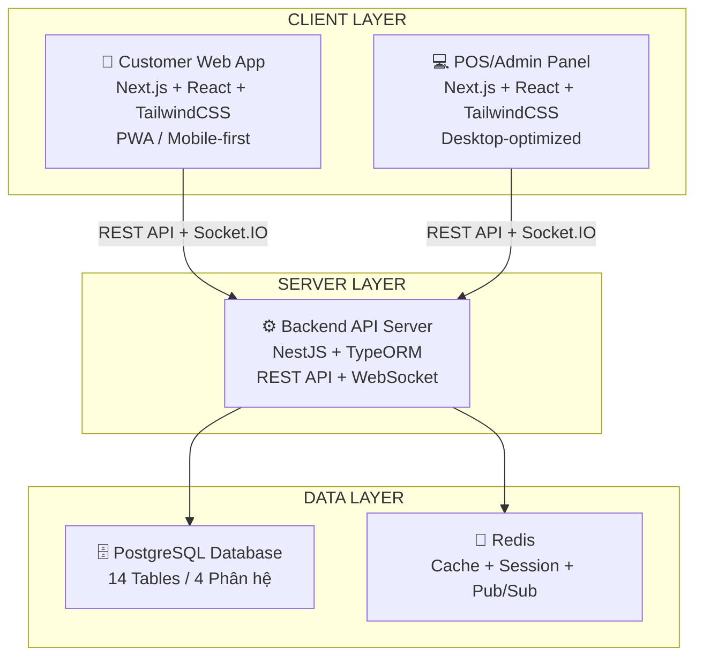
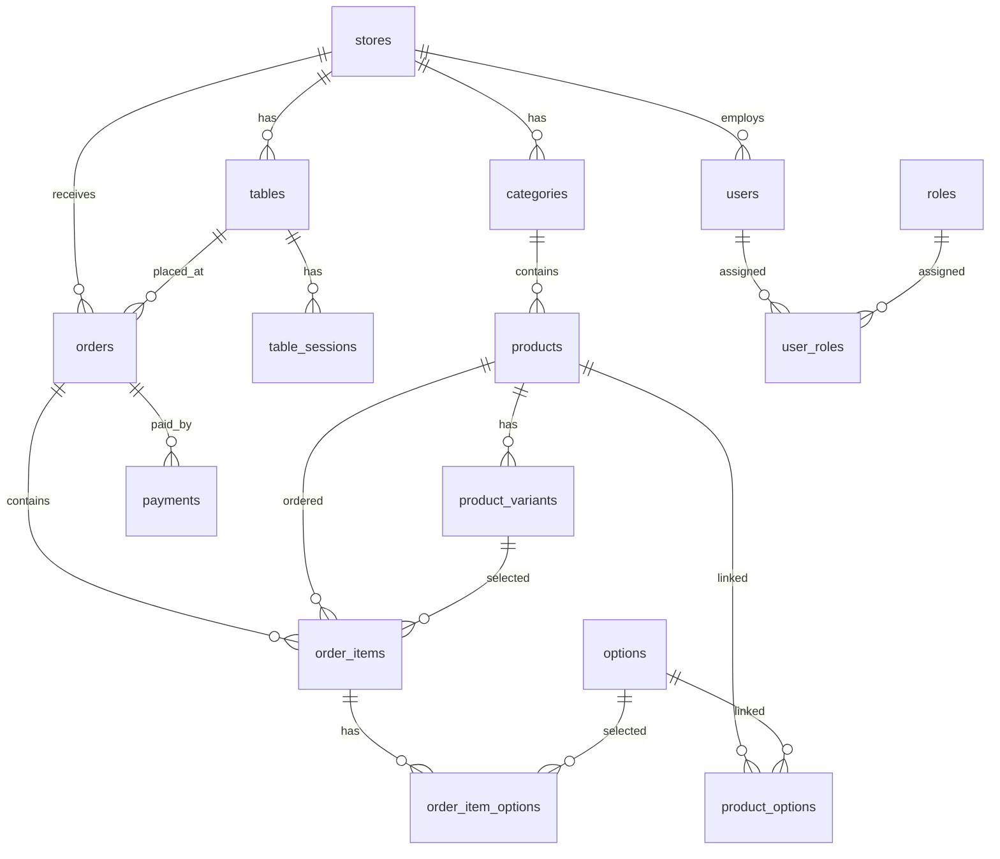
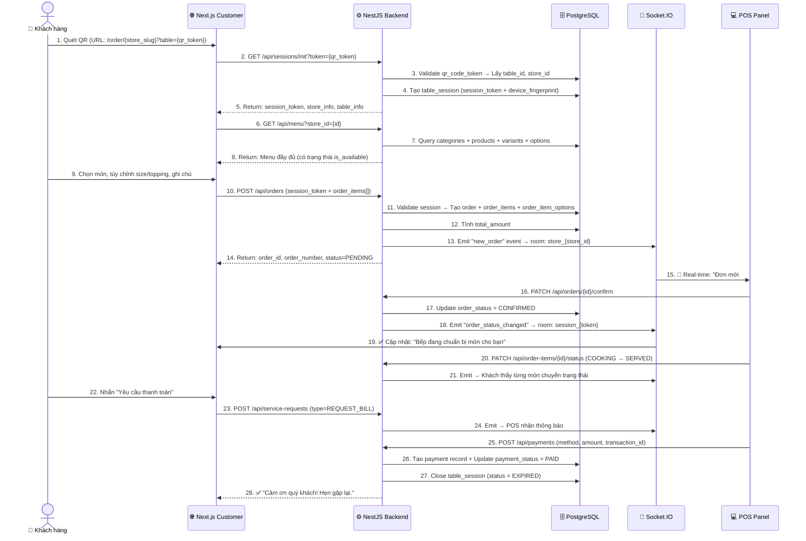
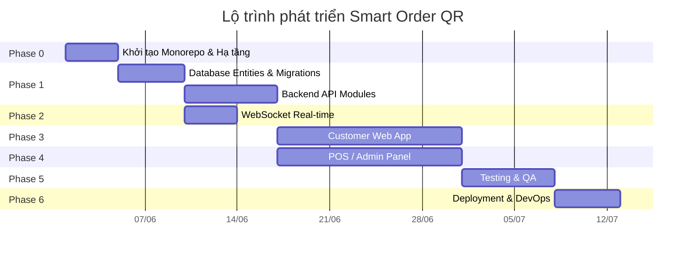
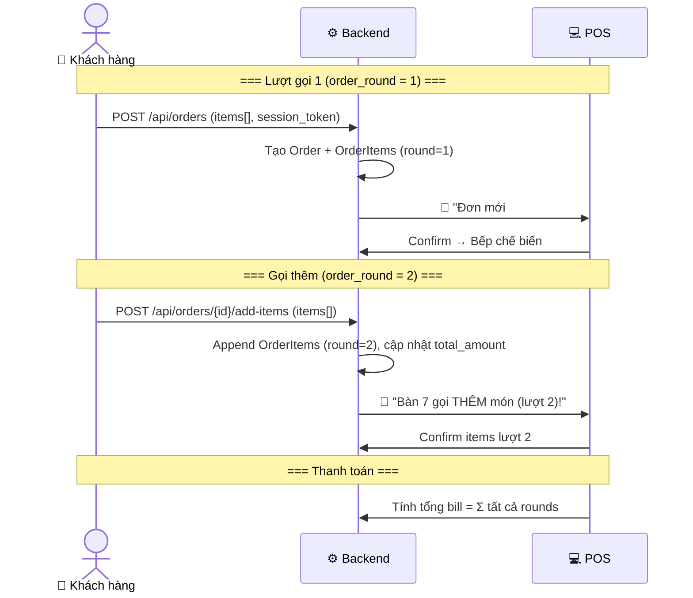

# 📋 PHÂN TÍCH CHUYÊN SÂU DỰ ÁN: SMART ORDER QR CODE
## Hệ thống Quản lý Đặt món Thông minh cho Cà phê & Nhà hàng

> [!NOTE]
> Tài liệu này được phân tích dựa trên 2 file đầu vào:
> - [phantichhethong.txt](file:///d:/smart-order/phantichhethong.txt) — Phân tích hệ thống & luồng hoạt động
> - [tables.txt](file:///d:/smart-order/tables.txt) — Thiết kế cơ sở dữ liệu chi tiết

---

## 1. TỔNG QUAN DỰ ÁN

### 1.1. Bản chất hệ thống
Đây là một hệ thống **Self-Service O2O (Online-to-Offline)** — biến smartphone của khách hàng thành thiết bị đặt món di động thông qua QR Code. Hệ thống phục vụ cho **một cửa hàng duy nhất** (Single-store), dùng làm đồ án môn học. Hệ thống hoạt động theo mô hình **3 thành phần chính**:



### 1.2. Tech Stack xác nhận

| Layer | Công nghệ | Vai trò |
|---|---|---|
| **Frontend - Customer** | Next.js 15 + React 19 + TailwindCSS 4 | Web App cho khách quét QR đặt món |
| **Frontend - POS/Admin** | Next.js 15 + React 19 + TailwindCSS 4 | Bảng điều khiển thu ngân, bếp, admin |
| **Backend** | NestJS + TypeORM + Socket.IO | API Server, WebSocket, Business Logic |
| **Database** | PostgreSQL 16 | Lưu trữ dữ liệu chính |
| **Cache/Realtime** | Redis | Session, Cache, Pub/Sub cho Socket |
| **Auth** | JWT (Access Token + Refresh Token) | Xác thực & Phân quyền |
| **Deploy** | Vercel (2 FE apps) + Railway (BE + PostgreSQL) | Cloud hosting |

### 1.3. Các quyết định thiết kế đã xác nhận

| # | Câu hỏi | Quyết định | Ảnh hưởng |
|---|---|---|---|
| 1 | Single-store hay Multi-store? | **Single-store** | Giữ `store_id` FK nhưng default 1 quán, bỏ UI quản lý multi-store |
| 2 | Thanh toán online? | **Không** — Chỉ thanh toán tiền mặt tại quầy | Loại bỏ VNPay/MoMo integration, đơn giản hóa `payments` table |
| 3 | In ấn? | **Defer** — Chỉ ra vị trí trong code + mẫu in, triển khai sau (USB ESC/POS) | Tạo stub/placeholder cho print module, thiết kế receipt template |
| 4 | Đa ngôn ngữ? | **Bỏ qua** — Chỉ tiếng Việt | Không cần i18n framework, giảm complexity |
| 5 | Gọi thêm món? | **Append vào order cũ** + thêm cột `order_round` | Thêm trường `order_round` vào `order_items`, logic append items |
| 6 | Deploy? | **Vercel** (Customer + POS) + **Railway** (NestJS + PostgreSQL) | Không cần Docker cho production, cấu hình Railway CLI |

---

## 2. PHÂN TÍCH KIẾN TRÚC CƠ SỞ DỮ LIỆU

### 2.1. Tổng quan 4 phân hệ & 14 bảng



### 2.2. Đánh giá & Bổ sung thiết kế Database

Tài liệu gốc thiết kế tốt, tuy nhiên cần **bổ sung và điều chỉnh** một số điểm quan trọng:

> [!IMPORTANT]
> **Các điều chỉnh cần thiết so với thiết kế gốc:**

| Bảng | Điều chỉnh | Lý do |
|---|---|---|
| `stores` | Thêm `logo_url`, `opening_hours` | Hiển thị thông tin quán trên Customer App (single-store, seed 1 bản ghi) |
| `tables` | Thêm `capacity` (sức chứa), `area` (khu vực) | Phân khu bàn (trong nhà, ngoài trời, VIP) |
| `table_sessions` | Thêm `device_fingerprint`, `ip_address` | Chống spam: giới hạn 1 session/device |
| `products` | Thêm `preparation_time` (phút), `is_popular` | Hiển thị thời gian chờ, gợi ý món hot |
| `orders` | Thêm `order_number` (auto-increment/ngày) | Dễ gọi tên đơn: "Đơn #045" |
| `order_items` | Thêm `subtotal` (computed), `order_round` (INT, default 1) | Tổng = (price + topping_prices) × quantity. `order_round` phân biệt lượt gọi ban đầu (round=1) và gọi thêm (round=2,3...) |
| **[MỚI]** `service_requests` | Bảng mới | Lưu yêu cầu "Gọi nhân viên", "Xin tính tiền" |
| **[MỚI]** `notifications` | Bảng mới | Lưu thông báo push cho POS/Kitchen |
| **[MỚI]** `activity_logs` | Bảng mới | Audit trail: ai làm gì, lúc nào |

### 2.3. Bảng bổ sung chi tiết

```
service_requests:
  id (PK), table_id (FK), session_id (FK), 
  request_type (ENUM: CALL_STAFF, REQUEST_BILL, OTHER),
  message (TEXT, nullable), 
  status (ENUM: PENDING, ACKNOWLEDGED, RESOLVED),
  created_at, resolved_at

notifications:
  id (PK), store_id (FK), 
  type (ENUM: NEW_ORDER, ORDER_CONFIRMED, SERVICE_REQUEST),
  reference_id (ID đơn hàng hoặc request tương ứng),
  is_read (BOOLEAN), created_at

activity_logs:
  id (PK), user_id (FK), store_id (FK),
  action (STRING: "ORDER_CONFIRMED", "ITEM_STATUS_CHANGED"...),
  entity_type, entity_id, metadata (JSONB), created_at
```

---

## 3. PHÂN TÍCH LUỒNG HOẠT ĐỘNG CHI TIẾT

### 3.1. Luồng chính: Khách đặt món qua QR



### 3.2. Các luồng phụ cần xây dựng

| # | Luồng | Mô tả |
|---|---|---|
| 1 | **Gọi thêm món** | Khách đặt thêm trong cùng session → **Append vào order hiện tại** với `order_round` tăng dần. POS nhận thông báo "Bàn X gọi thêm món (lượt 2)" |
| 2 | **Từ chối đơn** | Thu ngân reject → Khách nhận thông báo lý do + có thể đặt lại |
| 3 | **Hết món đột xuất** | Admin toggle `is_available = false` → Menu cập nhật real-time |
| 4 | **Gọi nhân viên** | Service request → Notification tới POS |
| 5 | **Thanh toán tại quầy** | Thu ngân xác nhận đã thu tiền mặt → Đóng session |

---

## 4. CẤU TRÚC DỰ ÁN (Monorepo)

```
d:\smart-order\
├── apps/
│   ├── customer/              ← Next.js: Web App cho khách hàng
│   │   ├── app/
│   │   │   ├── (order)/       ← Route group đặt món
│   │   │   │   ├── [storeSlug]/
│   │   │   │   │   ├── page.tsx         ← Landing + Init session
│   │   │   │   │   ├── menu/page.tsx    ← Trang menu
│   │   │   │   │   ├── cart/page.tsx    ← Giỏ hàng & xác nhận
│   │   │   │   │   └── tracking/page.tsx ← Theo dõi đơn hàng
│   │   │   ├── layout.tsx
│   │   │   └── globals.css
│   │   ├── components/
│   │   ├── hooks/
│   │   ├── lib/
│   │   ├── public/
│   │   ├── next.config.ts
│   │   ├── tailwind.config.ts
│   │   └── package.json
│   │
│   ├── pos/                   ← Next.js: POS Panel (Thu ngân + Bếp)
│   │   ├── app/
│   │   │   ├── (auth)/
│   │   │   │   └── login/page.tsx
│   │   │   ├── (dashboard)/
│   │   │   │   ├── orders/page.tsx       ← Quản lý đơn real-time
│   │   │   │   ├── kitchen/page.tsx      ← Màn hình bếp (KDS)
│   │   │   │   ├── tables/page.tsx       ← Sơ đồ bàn
│   │   │   │   ├── menu/page.tsx         ← Quản lý menu
│   │   │   │   ├── reports/page.tsx      ← Báo cáo doanh thu
│   │   │   │   └── settings/page.tsx     ← Cài đặt, QR, users
│   │   │   ├── layout.tsx
│   │   │   └── globals.css
│   │   ├── components/
│   │   ├── hooks/
│   │   ├── lib/
│   │   └── package.json
│   │
│   └── api/                   ← NestJS: Backend API Server
│       ├── src/
│       │   ├── modules/
│       │   │   ├── auth/           ← JWT, Login, Guard
│       │   │   ├── stores/         ← CRUD cửa hàng
│       │   │   ├── tables/         ← CRUD bàn + QR token
│       │   │   ├── sessions/       ← Tạo/hủy session bàn
│       │   │   ├── menu/           ← Categories, Products, Variants, Options
│       │   │   ├── orders/         ← Đặt đơn, cập nhật trạng thái
│       │   │   ├── payments/       ← Xử lý thanh toán
│       │   │   ├── notifications/  ← Service requests, alerts
│       │   │   ├── reports/        ← Thống kê, báo cáo
│       │   │   └── websocket/      ← Socket.IO Gateway
│       │   ├── common/
│       │   │   ├── decorators/
│       │   │   ├── guards/
│       │   │   ├── filters/
│       │   │   ├── interceptors/
│       │   │   └── pipes/
│       │   ├── config/
│       │   ├── database/
│       │   │   ├── entities/       ← TypeORM Entities
│       │   │   ├── migrations/     ← Database migrations
│       │   │   └── seeds/          ← Dữ liệu mẫu
│       │   ├── app.module.ts
│       │   └── main.ts
│       ├── test/
│       ├── nest-cli.json
│       └── package.json
│
├── packages/                  ← Shared packages (Monorepo)
│   ├── shared-types/          ← TypeScript interfaces/types dùng chung
│   │   ├── src/
│   │   │   ├── dto/           ← Data Transfer Objects
│   │   │   ├── enums/         ← OrderStatus, PaymentMethod...
│   │   │   └── interfaces/   ← Entity interfaces
│   │   └── package.json
│   └── ui/                    ← Shared UI components (nếu cần)
│       └── package.json
│
├── docker-compose.yml         ← PostgreSQL + Redis + pgAdmin
├── turbo.json                 ← Turborepo config
├── package.json               ← Root package.json
├── tsconfig.base.json
└── .env.example
```

---

## 5. LỘ TRÌNH CÔNG VIỆC CHI TIẾT (PHÂN THEO PHASE)

---

### 🔷 PHASE 0: Khởi tạo dự án & Hạ tầng (3-4 ngày)

> Mục tiêu: Thiết lập monorepo, cấu hình dev environment, database sẵn sàng.

| # | Công việc | Chi tiết | Ưu tiên |
|---|---|---|---|
| 0.1 | **Khởi tạo Monorepo** | Setup Turborepo, cấu hình `turbo.json`, root `package.json`, `tsconfig.base.json` | 🔴 Cao |
| 0.2 | **Tạo app: `apps/api`** | `nest new api`, cài TypeORM, `@nestjs/config`, class-validator, class-transformer | 🔴 Cao |
| 0.3 | **Tạo app: `apps/customer`** | `npx create-next-app`, cài TailwindCSS 4, cấu hình App Router | 🔴 Cao |
| 0.4 | **Tạo app: `apps/pos`** | `npx create-next-app`, cài TailwindCSS 4, cấu hình App Router | 🔴 Cao |
| 0.5 | **Tạo package: `shared-types`** | Định nghĩa enums (`OrderStatus`, `PaymentMethod`...), interfaces, DTOs | 🔴 Cao |
| 0.6 | **Docker Compose** | PostgreSQL 16, Redis 7, pgAdmin 4. Viết `docker-compose.yml` | 🔴 Cao |
| 0.7 | **Cấu hình Database** | TypeORM datasource config, connection pooling, migration setup | 🔴 Cao |
| 0.8 | **Cấu hình ESLint + Prettier** | Thống nhất code style toàn monorepo | 🟡 TB |
| 0.9 | **Env & Secrets Management** | `.env.example`, `@nestjs/config` với validation schema | 🟡 TB |

---

### 🔷 PHASE 1: Database & Backend Core (7-10 ngày)

> Mục tiêu: Hoàn thành toàn bộ entities, migrations, và API CRUD cơ bản.

#### 1A. Database Entities & Migrations

| # | Công việc | Chi tiết | Ưu tiên |
|---|---|---|---|
| 1.1 | **Entity: `Store`** | Các trường theo thiết kế + `logo_url`, `opening_hours` | 🔴 Cao |
| 1.2 | **Entity: `Table`** | + `capacity`, `area`, `qr_code_token` (unique) | 🔴 Cao |
| 1.3 | **Entity: `TableSession`** | + `device_fingerprint`, `ip_address`, auto-expire logic | 🔴 Cao |
| 1.4 | **Entity: `Category`** | + `priority` ordering, `is_active` | 🔴 Cao |
| 1.5 | **Entity: `Product`** | + `preparation_time`, `is_popular`, `image_url` | 🔴 Cao |
| 1.6 | **Entity: `ProductVariant`** | `price_adjustment`, `is_default` | 🔴 Cao |
| 1.7 | **Entity: `Option`** | `option_type` enum (sugar/ice/topping), `price` | 🔴 Cao |
| 1.8 | **Entity: `ProductOption`** | Bảng trung gian n-n (Composite Key) | 🔴 Cao |
| 1.9 | **Entity: `Order`** | `order_number` auto-gen, `order_status`, `payment_status` | 🔴 Cao |
| 1.10 | **Entity: `OrderItem`** | + `subtotal` computed, `item_status` | 🔴 Cao |
| 1.11 | **Entity: `OrderItemOption`** | Lưu snapshot giá topping tại thời điểm đặt | 🔴 Cao |
| 1.12 | **Entity: `Payment`** | `payment_method` enum (chỉ CASH cho MVP), `status` | 🔴 Cao |
| 1.13 | **Entity: `User`** | `password_hash`, `store_id`, `is_active` | 🔴 Cao |
| 1.14 | **Entity: `Role` + `UserRole`** | RBAC: Admin, Cashier, Kitchen, Waiter | 🔴 Cao |
| 1.15 | **Entity: `ServiceRequest`** | Bảng mới: gọi nhân viên, yêu cầu bill | 🟡 TB |
| 1.16 | **Entity: `Notification`** | Bảng mới: thông báo real-time | 🟡 TB |
| 1.17 | **Entity: `ActivityLog`** | Bảng mới: audit trail | 🟢 Thấp |
| 1.18 | **Database Migrations** | Tạo initial migration từ tất cả entities | 🔴 Cao |
| 1.19 | **Database Seeds** | Dữ liệu mẫu: 1 store, 10 bàn, 20 món, 5 user | 🟡 TB |

#### 1B. API Modules (NestJS)

| # | Công việc | Chi tiết | Ưu tiên |
|---|---|---|---|
| 1.20 | **Auth Module** | JWT strategy, login/logout, access+refresh token, password hash (bcrypt) | 🔴 Cao |
| 1.21 | **Auth Guards** | `JwtAuthGuard`, `RolesGuard` (decorator-based RBAC) | 🔴 Cao |
| 1.22 | **Store Module** | Read + Update thông tin quán (single-store, seed sẵn) | 🟡 TB |
| 1.23 | **Tables Module** | CRUD bàn + Generate QR token + API lấy QR image | 🔴 Cao |
| 1.24 | **Sessions Module** | `POST /sessions/init` (tạo session từ QR token), validate, expire | 🔴 Cao |
| 1.25 | **Menu Module** | CRUD categories, products, variants, options. Bulk update `is_available` | 🔴 Cao |
| 1.26 | **Orders Module** | Tạo đơn, **append items (gọi thêm món)**, confirm, reject, update item status. Tính `total_amount` tổng tất cả rounds | 🔴 Cao |
| 1.27 | **Payments Module** | Ghi nhận thanh toán tiền mặt tại quầy, đóng session khi paid | 🟡 TB |
| 1.28 | **Service Requests Module** | CRUD yêu cầu dịch vụ (gọi NV, tính tiền) | 🟡 TB |
| 1.29 | **Reports Module** | Doanh thu theo ngày/ca, top món bán chạy, thống kê đơn | 🟢 Thấp |
| 1.30 | **Validation & Error Handling** | Global exception filter, DTO validation pipes | 🔴 Cao |

---

### 🔷 PHASE 2: WebSocket Real-time (3-4 ngày)

> Mục tiêu: Kết nối real-time giữa Customer ↔ Server ↔ POS bằng Socket.IO.

| # | Công việc | Chi tiết | Ưu tiên |
|---|---|---|---|
| 2.1 | **NestJS WebSocket Gateway** | `@nestjs/websockets` + Socket.IO adapter, Redis adapter cho scale | 🔴 Cao |
| 2.2 | **Room Management** | `store_{id}` cho POS, `session_{token}` cho từng khách | 🔴 Cao |
| 2.3 | **Event: `new_order`** | Server → POS khi có đơn mới (kèm data order) | 🔴 Cao |
| 2.4 | **Event: `order_status_changed`** | Server → Customer khi trạng thái đơn thay đổi | 🔴 Cao |
| 2.5 | **Event: `item_status_changed`** | Server → Customer khi từng món chuyển trạng thái | 🔴 Cao |
| 2.6 | **Event: `service_request`** | Server → POS khi khách gọi nhân viên | 🟡 TB |
| 2.7 | **Event: `menu_updated`** | Server → All customers khi admin bật/tắt món | 🟡 TB |
| 2.8 | **Notification Sound System** | Tích hợp âm thanh cảnh báo trên POS khi có event | 🟡 TB |
| 2.9 | **Connection Health Check** | Heartbeat, auto-reconnect, offline queue | 🟡 TB |

---

### 🔷 PHASE 3: Frontend - Customer Web App (10-14 ngày)

> Mục tiêu: Xây dựng trải nghiệm đặt món mobile-first, PWA, tải nhanh < 3s.

#### 3A. Core Pages

| # | Công việc | Chi tiết | Ưu tiên |
|---|---|---|---|
| 3.1 | **Landing Page** | Quét QR → Init session → Hiển thị tên quán, số bàn, welcome message | 🔴 Cao |
| 3.2 | **Menu Page** | Danh sách category tabs, grid sản phẩm, ảnh, giá, badge "Hết hàng" | 🔴 Cao |
| 3.3 | **Product Detail Bottom Sheet** | Chọn size, topping, mức đường/đá, ghi chú, số lượng | 🔴 Cao |
| 3.4 | **Cart Page** | Danh sách món đã chọn, sửa/xóa, tổng tiền, nút đặt | 🔴 Cao |
| 3.5 | **Order Tracking Page** | Timeline trạng thái đơn (real-time update), danh sách món + status | 🔴 Cao |
| 3.6 | **Order Success / Thank You** | Hiển thị sau khi thanh toán hoàn tất | 🟡 TB |

#### 3B. Components & Features

| # | Công việc | Chi tiết | Ưu tiên |
|---|---|---|---|
| 3.7 | **Search Bar** | Tìm kiếm món ăn theo tên, filter theo category | 🟡 TB |
| 3.8 | **Floating Cart Button** | FAB hiển thị số lượng món trong giỏ, nhấn vào mở cart | 🔴 Cao |
| 3.9 | **Service Request Button** | Nút "Gọi nhân viên" (fixed bottom), popup chọn loại yêu cầu | 🟡 TB |
| 3.10 | **Skeleton Loading** | Shimmer effect khi load menu, tăng perceived performance | 🟡 TB |
| 3.11 | **Toast Notifications** | Thông báo real-time (đơn được xác nhận, món đã phục vụ...) | 🔴 Cao |
| 3.12 | **Error & Empty States** | UI xử lý lỗi mạng, session hết hạn, giỏ hàng trống | 🔴 Cao |
| 3.13 | **PWA Manifest + Service Worker** | Offline fallback, Add to Home Screen, caching strategies | 🟢 Thấp |
| 3.14 | **SEO & Meta Tags** | Dynamic OG tags, structured data cho mỗi store | 🟢 Thấp |

#### 3C. State Management & API Integration

| # | Công việc | Chi tiết | Ưu tiên |
|---|---|---|---|
| 3.15 | **Zustand Store** | Cart state, session state, order tracking state | 🔴 Cao |
| 3.16 | **API Client (Axios/Fetch)** | Interceptors, error handling, token attachment | 🔴 Cao |
| 3.17 | **React Query / TanStack Query** | Server state caching, mutation, optimistic updates | 🔴 Cao |
| 3.18 | **Socket.IO Client** | Kết nối WebSocket, lắng nghe events, auto-reconnect | 🔴 Cao |

---

### 🔷 PHASE 4: Frontend - POS / Admin Panel (10-14 ngày)

> Mục tiêu: Dashboard vận hành cho thu ngân, bếp và quản lý.

#### 4A. Authentication & Layout

| # | Công việc | Chi tiết | Ưu tiên |
|---|---|---|---|
| 4.1 | **Login Page** | Form đăng nhập, JWT token storage | 🔴 Cao |
| 4.2 | **Dashboard Layout** | Sidebar navigation, header (user info, store info), responsive | 🔴 Cao |
| 4.3 | **Role-based Routing** | Redirect theo role: Cashier → Orders, Kitchen → KDS, Admin → full | 🔴 Cao |

#### 4B. Order Management (Thu ngân)

| # | Công việc | Chi tiết | Ưu tiên |
|---|---|---|---|
| 4.4 | **Orders Dashboard** | Kanban board: Pending → Confirmed → Completed. Real-time update | 🔴 Cao |
| 4.5 | **Order Detail Panel** | Slide-over panel hiển thị chi tiết đơn, nút Confirm/Reject | 🔴 Cao |
| 4.6 | **Sound Notification** | Âm thanh "Ting!" khi đơn mới đến, notification badge | 🔴 Cao |
| 4.7 | **Quick Actions** | Confirm all, Reject với lý do, Mark as Served | 🟡 TB |

#### 4C. Kitchen Display System (KDS) — Bếp

| # | Công việc | Chi tiết | Ưu tiên |
|---|---|---|---|
| 4.8 | **Kitchen Screen** | Grid cards hiển thị danh sách món cần chế biến, theo thứ tự thời gian | 🔴 Cao |
| 4.9 | **Item Status Toggle** | Nhấn để chuyển: PENDING → COOKING → SERVED | 🔴 Cao |
| 4.10 | **Color-coded Priority** | Đơn chờ lâu → highlight đỏ, đơn mới → xanh | 🟡 TB |

#### 4D. Quản lý Menu

| # | Công việc | Chi tiết | Ưu tiên |
|---|---|---|---|
| 4.11 | **Category CRUD** | Thêm/sửa/xóa danh mục, drag-and-drop sắp xếp priority | 🔴 Cao |
| 4.12 | **Product CRUD** | Form tạo/sửa món: ảnh, giá, variants, options | 🔴 Cao |
| 4.13 | **Quick Toggle Available** | Switch on/off nhanh trạng thái "Còn hàng" → real-time sync | 🔴 Cao |
| 4.14 | **Image Upload** | Upload ảnh món lên cloud storage (S3/Cloudinary) | 🟡 TB |

#### 4E. Quản lý Bàn & QR

| # | Công việc | Chi tiết | Ưu tiên |
|---|---|---|---|
| 4.15 | **Table Map View** | Sơ đồ bàn visual: trạng thái Trống/Có khách/Chờ dọn | 🟡 TB |
| 4.16 | **QR Code Generator** | Tạo & in mã QR cho từng bàn (PDF export) | 🔴 Cao |
| 4.17 | **Table CRUD** | Thêm/sửa/xóa bàn, gán khu vực | 🔴 Cao |

#### 4F. Thanh toán

| # | Công việc | Chi tiết | Ưu tiên |
|---|---|---|---|
| 4.18 | **Payment Dialog** | Xác nhận thanh toán tiền mặt tại quầy, hiển thị tổng bill | 🔴 Cao |
| 4.19 | **Receipt/Bill View** | Xem hóa đơn chi tiết (phân theo round gọi món) | 🟡 TB |
| 4.20 | **Print Stub (ESC/POS)** | Placeholder cho in hóa đơn qua máy in nhiệt USB. Tạo receipt template HTML + comment chỉ rõ vị trí tích hợp ESC/POS commands | 🟢 Thấp |

#### 4G. Báo cáo & Thống kê

| # | Công việc | Chi tiết | Ưu tiên |
|---|---|---|---|
| 4.21 | **Doanh thu theo ngày** | Biểu đồ cột/line, tổng số đơn, tổng tiền | 🟡 TB |
| 4.22 | **Top món bán chạy** | Pie chart hoặc bar chart, top 10 sản phẩm | 🟡 TB |
| 4.23 | **Báo cáo theo ca** | Filter theo ca làm việc (sáng/chiều/tối) | 🟢 Thấp |
| 4.24 | **Export Excel/PDF** | Xuất báo cáo ra file | 🟢 Thấp |

#### 4H. Quản lý Người dùng (Admin)

| # | Công việc | Chi tiết | Ưu tiên |
|---|---|---|---|
| 4.25 | **User CRUD** | Thêm/sửa/xóa nhân viên, gán store | 🟡 TB |
| 4.26 | **Role Assignment** | Gán vai trò cho nhân viên (multi-role) | 🟡 TB |
| 4.27 | **Store Settings** | Cài đặt thông tin quán, logo, giờ mở cửa | 🟡 TB |

---

### 🔷 PHASE 5: Tích hợp & Testing (5-7 ngày)

> Mục tiêu: Kiểm thử toàn diện, fix bugs, tối ưu hiệu năng.

| # | Công việc | Chi tiết | Ưu tiên |
|---|---|---|---|
| 5.1 | **E2E Testing Flow** | Test toàn bộ luồng: Quét QR → Đặt món → POS nhận → Thanh toán | 🔴 Cao |
| 5.2 | **API Unit Tests** | Jest + Supertest cho tất cả endpoints | 🔴 Cao |
| 5.3 | **WebSocket Testing** | Test real-time events, reconnection, edge cases | 🔴 Cao |
| 5.4 | **Load Testing** | Simulate 50+ concurrent orders (Artillery/k6) | 🟡 TB |
| 5.5 | **Mobile Responsive QA** | Test trên nhiều kích thước màn hình, trình duyệt | 🔴 Cao |
| 5.6 | **Performance Optimization** | Lighthouse audit, lazy loading, image optimization | 🟡 TB |
| 5.7 | **Security Audit** | XSS, CSRF, SQL Injection, rate limiting, session hijacking | 🔴 Cao |
| 5.8 | **Error Monitoring Setup** | Sentry hoặc tương tự cho cả FE + BE | 🟡 TB |

---

### 🔷 PHASE 6: Deployment — Vercel + Railway (3-5 ngày)

> Mục tiêu: Deploy lên Vercel (2 Next.js apps) + Railway (NestJS + PostgreSQL + Redis).

| # | Công việc | Chi tiết | Ưu tiên |
|---|---|---|---|
| 6.1 | **Vercel Setup — Customer App** | Connect Git repo, cấu hình `apps/customer` build, env vars | 🔴 Cao |
| 6.2 | **Vercel Setup — POS App** | Connect Git repo, cấu hình `apps/pos` build, env vars | 🔴 Cao |
| 6.3 | **Railway Setup — NestJS API** | Deploy `apps/api`, cấu hình start command, env vars | 🔴 Cao |
| 6.4 | **Railway Setup — PostgreSQL** | Provision PostgreSQL addon, chạy migrations | 🔴 Cao |
| 6.5 | **Railway Setup — Redis** | Provision Redis addon, cấu hình connection | 🔴 Cao |
| 6.6 | **Domain & CORS** | Cấu hình custom domain (nếu có), CORS giữa Vercel ↔ Railway | 🔴 Cao |
| 6.7 | **CI/CD Pipeline** | GitHub Actions: lint → test → auto-deploy on push | 🟡 TB |
| 6.8 | **Database Seeding** | Chạy seed data production (1 store, bàn, menu mẫu) | 🟡 TB |

---

## 6. TIMELINE ƯỚC TÍNH TỔNG THỂ



| Phase | Nội dung | Thời gian ước tính |
|---|---|---|
| Phase 0 | Khởi tạo dự án | 3-4 ngày |
| Phase 1 | Database & Backend Core | 7-10 ngày |
| Phase 2 | WebSocket Real-time | 3-4 ngày |
| Phase 3 | Customer Web App | 10-14 ngày |
| Phase 4 | POS / Admin Panel | 10-14 ngày |
| Phase 5 | Testing & QA | 5-7 ngày |
| Phase 6 | Deployment | 3-5 ngày |
| **TỔNG** | **MVP hoàn chỉnh** | **~6-8 tuần** |

> [!TIP]
> Phase 3 và Phase 4 có thể được phát triển **song song** nếu có 2 developer trở lên, giúp rút ngắn timeline xuống còn ~5-6 tuần.

---

## 7. NHỮNG ĐIỂM CẦN LƯU Ý ĐẶC BIỆT

### 7.1. Anti-Spam & Bảo mật Session

> [!WARNING]
> Đây là yếu tố **cực kỳ quan trọng** mà tài liệu gốc đã nhấn mạnh. Cần implement:

- **Device Fingerprint**: Khi quét QR, ghi nhận fingerprint thiết bị (FingerprintJS) để 1 thiết bị chỉ tạo được 1 session tại 1 thời điểm.
- **Session Lock**: Session gắn chặt với `table_id` + `device_fingerprint`. Không thể dùng session token của bàn A để order vào bàn B.
- **Rate Limiting**: Giới hạn số order/phút từ 1 session (tránh spam liên tục).
- **Session Expiry**: Auto-expire session sau N phút không hoạt động (idle timeout).

### 7.2. Snapshot giá tại thời điểm đặt

> [!IMPORTANT]
> `order_items.price` và `order_item_options.price` phải lưu giá **tại thời điểm đặt**, KHÔNG reference giá hiện tại từ bảng `products`/`options`. Điều này đảm bảo nếu admin thay đổi giá sau, hóa đơn cũ không bị ảnh hưởng.

### 7.3. Concurrency & Race Conditions
- Khi 2 thu ngân cùng confirm 1 đơn → cần **optimistic locking** (version column) hoặc **pessimistic locking** trong transaction.
- Khi khách gửi 2 order cùng lúc → validate session state + sử dụng database transaction với isolation level phù hợp.

### 7.4. Offline Handling (Customer App)
- Nếu mất kết nối WiFi: hiển thị banner cảnh báo, lưu cart vào localStorage, auto-retry khi online lại.
- WebSocket reconnect: exponential backoff + replay missed events.

---

## 8. CHI TIẾT THIẾT KẾ: LOGIC GỌI THÊM MÓN (Append Order)

Đây là phần thiết kế quan trọng được quyết định dựa trên yêu cầu của chủ dự án:

### 8.1. Luồng hoạt động



### 8.2. Thay đổi Database

```sql
-- Thêm cột order_round vào order_items
ALTER TABLE order_items ADD COLUMN order_round INT DEFAULT 1;
-- Round 1 = lượt gọi ban đầu
-- Round 2, 3... = các lượt gọi thêm

-- Hóa đơn sẽ hiển thị:
-- ═══ Lượt gọi 1 ═══
-- Cà phê sữa đá (M)    x2    50,000đ
-- Bánh mì                x1    25,000đ
-- ═══ Gọi thêm (Lượt 2) ═══  
-- Trà đào                x1    35,000đ
-- ─────────────────────────────
-- TỔNG:                       110,000đ
```

### 8.3. API Endpoint mới

```
POST /api/orders/:orderId/add-items
Body: { items: [{ product_id, variant_id, quantity, note, options[] }] }
Logic:
  1. Validate: order phải đang ACTIVE (chưa COMPLETED/CANCELLED)
  2. Validate: session phải còn active
  3. Tính max(order_round) hiện tại → new_round = max + 1
  4. Tạo order_items mới với order_round = new_round
  5. Cập nhật total_amount của order
  6. Emit socket event "order_items_added" → POS
```

---

## 9. CHI TIẾT THIẾT KẾ: IN ẤN (Print Module — Deferred)

> [!NOTE]
> Phần in ấn sẽ được **triển khai sau** nhưng thiết kế sẵn vị trí trong mã nguồn.

### 9.1. Vị trí trong mã nguồn

```
apps/api/src/modules/printing/
├── printing.module.ts       ← NestJS module
├── printing.service.ts      ← Logic tạo ESC/POS commands
├── printing.controller.ts   ← API endpoint trigger in
├── templates/
│   ├── receipt.template.ts  ← Mẫu hóa đơn
│   └── kitchen-ticket.template.ts  ← Mẫu phiếu bếp
└── drivers/
    └── usb-escpos.driver.ts ← Driver giao tiếp USB (placeholder)

apps/pos/components/printing/
├── ReceiptPreview.tsx       ← Xem trước hóa đơn trên POS
└── PrintButton.tsx          ← Nút in (gọi API)
```

### 9.2. Mẫu hóa đơn (Receipt Template)

```
╔══════════════════════════════╗
║     TÊN CỬA HÀNG CÀ PHÊ     ║
║   123 Đường ABC, Quận XYZ     ║
║   ĐT: 0909 xxx xxx            ║
╠══════════════════════════════╣
║ HÓA ĐƠN THANH TOÁN           ║
║ Số: #045        Bàn: 7        ║
║ Ngày: 29/05/2026  14:30       ║
╠══════════════════════════════╣
║ Cà phê sữa đá (M)  x2 50,000 ║
║   + Trân châu đen      5,000  ║
║ Bánh mì ốp la      x1 25,000  ║
║ --- Gọi thêm (Lượt 2) ---    ║
║ Trà đào cam sả     x1 35,000  ║
╠══════════════════════════════╣
║ TỔNG CỘNG:          115,000đ  ║
║ Thanh toán: Tiền mặt          ║
╠══════════════════════════════╣
║   Cảm ơn quý khách!          ║
║   Hẹn gặp lại! ☕             ║
╚══════════════════════════════╝
```

### 9.3. Protocol: USB ESC/POS

```typescript
// apps/api/src/modules/printing/drivers/usb-escpos.driver.ts
// TODO: Implement khi có máy in nhiệt
// Dependencies cần cài: escpos, usb
// npm install escpos escpos-usb

import * as escpos from 'escpos';
import * as USB from 'escpos-usb';

export class UsbEscPosDriver {
  async print(receiptData: ReceiptData): Promise<void> {
    const device = new USB();
    const printer = new escpos.Printer(device);
    
    device.open(() => {
      printer
        .align('CT')
        .style('B')
        .text(receiptData.storeName)
        .style('NORMAL')
        .text(receiptData.storeAddress)
        .drawLine()
        // ... render items
        .cut()
        .close();
    });
  }
}
```

---

> [!TIP]
> **Trạng thái: ĐÃ SẴN SÀNG TRIỂN KHAI** 🚀
> Tất cả câu hỏi đã được giải đáp. Bắt đầu từ Phase 0 — Khởi tạo Monorepo & Hạ tầng.
